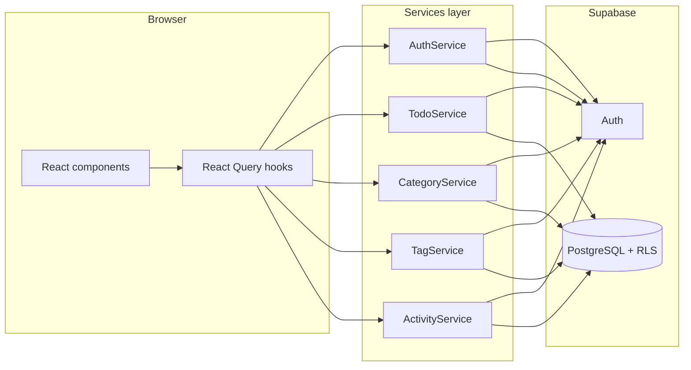

# TaskFlow — Project Documentation

TaskFlow is a full-stack todo application built with **Next.js 16** (App Router), **React 19**, **Supabase** (PostgreSQL + Auth), and **TanStack React Query**. Users sign in, manage todos with categories and tags, view activity on a dashboard, and export tasks to Excel.

---

## Table of contents

1. [Prerequisites](#prerequisites)
2. [Install and run Next.js](#install-and-run-nextjs)
3. [Configure Supabase database](#configure-supabase-database)
4. [Environment variables](#environment-variables)
5. [Project structure](#project-structure)
6. [Architecture overview](#architecture-overview)
7. [Features and how they work](#features-and-how-they-work)
8. [Scripts](#scripts)

---

## Prerequisites

- **Node.js** 20 or later (LTS recommended)
- **npm**, **pnpm**, **yarn**, or **bun**
- A free [Supabase](https://supabase.com) account

---

## Install and run Next.js

### Run this repository

1. Clone the repository and open the project folder.

2. Install dependencies:

   ```bash
   npm install
   ```

3. Copy the environment template and fill in your Supabase values (see [Environment variables](#environment-variables)):

   ```bash
   cp .env.example .env.local
   ```

4. Complete [Supabase setup](#configure-supabase-database) before starting the app.

5. Start the development server:

   ```bash
   npm run dev
   ```

6. Open [http://localhost:3000](http://localhost:3000).

### Production build

```bash
npm run build
npm start
```

### Create a new Next.js app from scratch (optional)

If you are starting a greenfield project instead of this repo:

```bash
npx create-next-app@latest my-app
```

Choose TypeScript, App Router, and Tailwind when prompted. This project was created with that flow and then extended with Supabase, services, and dashboard features. Match the versions in `package.json` (Next.js 16.x, React 19.x) if you want parity with this codebase.

---

## Configure Supabase database

All application data lives in Supabase PostgreSQL. Auth uses Supabase Auth; the browser talks to Supabase through the JavaScript client with **Row Level Security (RLS)** so each user only sees their own rows.

### 1. Create a Supabase project

1. Go to [https://supabase.com/dashboard](https://supabase.com/dashboard).
2. Click **New project**, pick an organization, name, database password, and region.
3. Wait until the project finishes provisioning.

### 2. Run the database schema

1. In the Supabase dashboard, open **SQL Editor**.
2. Open the file `db/001_initial_schema.sql` in this repository.
3. Copy the entire file contents and paste them into a new query in the SQL Editor.
4. Click **Run**.

This migration creates:

| Object | Purpose |
|--------|---------|
| `profiles` | User profile row linked to `auth.users` |
| `categories` | User-defined todo groupings (name, color, icon) |
| `tags` | Labels attachable to todos |
| `todos` | Core tasks (status, priority, due date, category) |
| `todo_tags` | Many-to-many link between todos and tags |
| `activity_logs` | Audit trail for dashboard charts |
| `todos_with_details` | View: todos + category + tags in one query |
| `activity_daily_summary` | View: per-day activity counts for charts |
| Triggers | Auto profile on signup, `updated_at`, full-text search, activity logging |
| RLS policies | Users can only access their own data |

### 3. Configure Supabase Auth URLs

Auth emails (signup confirmation, password reset) must redirect back to your app.

1. In Supabase: **Authentication** → **URL Configuration**.
2. Set **Site URL** to your app origin, e.g. `http://localhost:3000` for local dev.
3. Under **Redirect URLs**, add:
   - `http://localhost:3000/**` (local)
   - Your production URL when you deploy, e.g. `https://your-domain.com/**`

These must match `NEXT_PUBLIC_APP_URL` in `.env.local`.

### 4. Get API keys for the app

1. **Project Settings** → **API**.
2. Copy **Project URL** → `NEXT_PUBLIC_SUPABASE_URL`.
3. Copy **anon public** key → `NEXT_PUBLIC_SUPABASE_ANON_KEY`.

Never commit `.env.local` or expose the **service_role** key in client-side code. This app uses only the anon key in the browser; RLS enforces access control.

### 5. (Recommended) Email auth settings

For local development you can disable email confirmation:

- **Authentication** → **Providers** → **Email** → toggle **Confirm email** off for faster testing.

For production, keep confirmation enabled and configure SMTP under **Authentication** → **SMTP Settings** if you use custom email.

### 6. Verify setup

After `npm run dev`:

1. Visit `/signup` and create an account.
2. Check **Table Editor** → `profiles` — a row should appear for the new user (created by the `handle_new_user` trigger).
3. Sign in and create a todo on `/todos`.

---

## Environment variables

Create `.env.local` at the project root (see `.env.example`):

| Variable | Required | Description |
|----------|----------|-------------|
| `NEXT_PUBLIC_SUPABASE_URL` | Yes | Supabase project URL |
| `NEXT_PUBLIC_SUPABASE_ANON_KEY` | Yes | Supabase anon (public) API key |
| `NEXT_PUBLIC_APP_URL` | Yes | App origin for auth redirects (`http://localhost:3000` locally) |

Variables such as `DATABASE_URL` or `SUPABASE_SERVICE_ROLE_KEY` are **not** used by the current application code; data access goes through the Supabase client and RLS.

---

## Project structure

```
snjs/
├── app/                      # Next.js App Router pages
│   ├── (auth)/               # Login, signup, forgot/reset password
│   ├── (dashboard)/          # Dashboard, todos, categories, tags
│   ├── layout.tsx            # Root layout + providers
│   └── page.tsx              # Marketing landing page
├── components/               # UI and feature components
├── db/
│   └── 001_initial_schema.sql
├── docs/
│   └── PROJECT.md            # This file
├── hooks/                    # React Query hooks (useTodos, useAuth, …)
├── lib/
│   ├── supabase/             # Browser, server, and middleware clients
│   └── react-query/          # Query client and cache keys
├── schemas/                  # Zod validation (auth, todo, category, tag)
├── services/                 # Supabase data access layer
├── types/                    # TypeScript types (incl. database.types.ts)
└── proxy.ts                  # Route protection (session refresh + redirects)
```

---

## Architecture overview



**Request flow**

1. **`proxy.ts`** runs on matching routes. It refreshes the Supabase session from cookies and redirects unauthenticated users to `/login`, or signed-in users away from auth pages to `/dashboard`.
2. **Dashboard pages** wrap content in `UserGuard`, which loads the session via `useSession()` and passes `userId` to children.
3. **Hooks** (`hooks/*.ts`) call **services** (`services/*.ts`), which use `@supabase/supabase-js` with typed tables from `types/database.types.ts`.
4. **React Query** caches lists and invalidates after mutations.
5. **PostgreSQL triggers** write to `activity_logs` when todos change; the dashboard reads those logs without extra app code.

**Supabase clients**

| File | Used where |
|------|------------|
| `lib/supabase/client.ts` | Client components and services in the browser |
| `lib/supabase/server.ts` | Server Components / Route Handlers (cookie-based session) |
| `lib/supabase/middleware.ts` | Used by `proxy.ts` for session refresh |

---

## Features and how they work

### Landing page (`/`)

Public marketing page with links to sign in and sign up. No authentication required.

### Authentication

| Route | Feature |
|-------|---------|
| `/login` | Email + password sign-in |
| `/signup` | Registration with full name; optional email confirmation via Supabase |
| `/forgot-password` | Sends reset email with link to `/reset-password` |
| `/reset-password` | Sets a new password after following the email link |

**Implementation**

- Forms use **react-hook-form** + **Zod** schemas in `schemas/auth.schema.ts`.
- `AuthService` (`services/auth.service.ts`) wraps `supabase.auth` methods (`signInWithPassword`, `signUp`, `resetPasswordForEmail`, `updateUser`, `signOut`, `getUser`).
- `useAuth` hooks expose mutations and `useSession()` for the current user.
- Redirect URLs use `NEXT_PUBLIC_APP_URL` (signup → `/dashboard`, reset → `/reset-password`).
- On signup, the database trigger `handle_new_user` inserts a row into `public.profiles`.

### Dashboard (`/dashboard`)

Overview for the signed-in user:

- **Stats cards** — Counts total, active, completed, and archived todos (from `useTodos` with no status filter).
- **Activity chart** — Daily counts from the `activity_daily_summary` view (`ActivityService.getDailySummary`).
- **Recent activity** — Latest rows from `activity_logs` (`ActivityService.getLogs`).

Activity rows are created automatically by the `log_todo_activity` trigger when todos are inserted, updated, completed, archived, restored, or deleted.

### Todos (`/todos`)

Main task management UI:

- **List** — Reads from the `todos_with_details` view (title, status, priority, category, tags in one query).
- **Filters** — Status, priority, category, and search are stored in the URL via **nuqs** (`todo-filters.tsx` + `buildTodoFilters`).
- **Search** — Uses PostgreSQL full-text search on `search_vector` (maintained by DB trigger on title/description).
- **Create / edit** — Dialog form; creates/updates `todos` and syncs `todo_tags` junction rows.
- **Actions** — Complete (`status: completed`), archive (`status: archived`), restore (back to `active`), delete.
- **Export** — Downloads an `.xlsx` file via the `xlsx` library (`TodoService.exportToExcel`).

Hooks: `useTodos`, `useCreateTodo`, `useUpdateTodo`, `useDeleteTodo`, `useCompleteTodo`, `useArchiveTodo`, `useRestoreTodo`, `useExportTodos`.

### Categories (`/categories`)

CRUD for per-user categories (name, color, optional Lucide icon name). Todos optionally reference `category_id`. Deleting a category sets todos’ `category_id` to null (`ON DELETE SET NULL`).

Service: `CategoryService` · Hooks: `useCategories`.

### Tags (`/tags`)

CRUD for per-user tags. Todos can have many tags through `todo_tags`. Tag filter on the todos page filters client-side after fetching (tag is not a column on the view filter in PostgREST).

Service: `TagService` · Hooks: `useTags`.

### Route protection

- **`proxy.ts`** — Server-side gate: no user → redirect to `/login` (except `/` and auth routes); user on auth page → redirect to `/dashboard`.
- **`UserGuard`** — Client-side fallback while session loads; redirects if session is missing.

### Data validation

Zod schemas in `schemas/` validate form input before mutations. Services throw `ServiceError` on Supabase errors for display in UI alerts.

---

## Scripts

| Command | Description |
|---------|-------------|
| `npm run dev` | Start Next.js dev server (Turbopack) |
| `npm run build` | Production build |
| `npm start` | Run production server |
| `npm run lint` | Run ESLint |

---

## Troubleshooting

| Issue | What to check |
|-------|----------------|
| Redirect loop or always sent to login | `NEXT_PUBLIC_*` vars set; cookies allowed; Supabase URL/anon key correct |
| Signup works but no profile row | Re-run `001_initial_schema.sql`; confirm `trg_on_auth_user_created` exists |
| Password reset link invalid | `NEXT_PUBLIC_APP_URL` and Supabase redirect URLs include your origin |
| RLS errors / empty data | User is signed in; policies in migration section 10 were applied |
| Email not received | Supabase email rate limits; use dashboard Auth logs; disable confirm for local dev |

---

## Tech stack summary

- **Framework:** Next.js 16 (App Router), React 19
- **Styling:** Tailwind CSS 4
- **Backend:** Supabase (Auth + PostgreSQL)
- **Data fetching:** TanStack React Query 5
- **Forms:** react-hook-form + Zod 4
- **URL state:** nuqs
- **Charts:** Recharts
- **Export:** SheetJS (`xlsx`)

For Next.js APIs specific to this version, see guides under `node_modules/next/dist/docs/` in the repo (this project uses conventions that may differ from older Next.js versions).
